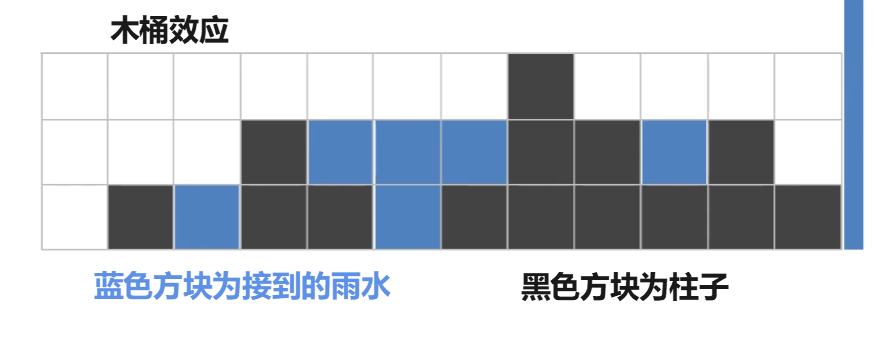
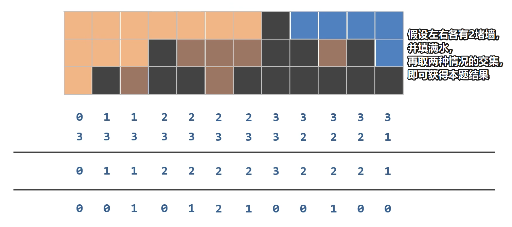

# 我的JAVA学习笔记

## 📑 目录
- [数组遍历](#数组遍历)
- [方法重载Overload](#方法重载overload)
- [输出格式化](#输出)
- [快慢指针算法](#快慢指针)
- [Java编码规范](#java编码规范)
- [算法题集](#算法题集)
- [面向对象](#面向对象)

---
## 数组遍历
**💡小彩蛋：快捷键生成**

在 IDEA 里，输入数组名后敲 .for 回车，自动补全增强 for：

```Plain Text
arr3.for   → 回车 → 自动生成 for (int num : arr3) { }
arr3.fori  → 回车 → 自动生成普通带下标的 for 循环
```
也不能乱用，增强for循环中，i成了元素，不能通过i来访问索引。

✅适用场景：仅读取元素
打印、求和、找最大最小值、判断是否存在某元素。

❌不适用场景（要用普通 for）
需要下标；修改数组元素；倒序遍历；按条件跳过部分元素。

> 在[MethodDemo3.java](/src/main/java/method/MethodDemo3.java)中，踩过一次坑，通过增强for循环中的i进行索引访问。

**错误案例：**
```java
public static void printArray(int[] arr) {

    for (int i : arr) {
        if (i == 0)
            System.out.print("[" + arr[i]);
        else if (i == arr.length - 1)
            System.out.print(arr[i] + "]");
        else
            System.out.print(arr[i] + ",");
    }
}
```


## 方法重载（Overload）
> 同一个类中，多个方法**方法名相同**，参数列表不同。

### 构成重载条件
1. ✅ 方法名必须一致
2. ✅ **参数列表必须不同**：参数个数、类型、顺序不一样
3. ❌ **和返回值类型无关**，不能依靠返回值区分重载
4. ❌ 和修饰符无关

### 调用规则
- 编译器根据**实参的个数、数据类型**自动匹配对应的重载方法。
- 当出现多个匹配方法时，编译器会报错。案例：[MethodDemo4.java](/src/main/java/method/MethodDemo4.java)

### 示例
```java
public static double getSum(int a,int b){}
public static double getSum(int a,double b){}
```

### 易错
仅改返回值，不算重载，直接编译报错。


## 输出格式化
### String.format()
1. 作用：格式化字符串，返回String对象，不直接控制台打印
2. 常用占位符
- `%d` 整数
- `%f` 浮点数；`%.2f` 保留2位小数，自动四舍五入
- `%s` 字符串
- `%%` 用来输出一个百分号 %
3. 与printf区别
   printf：直接输出；String.format：生成字符串，可保存复用
4. ⚠️易错点
- 返回字符串，不能直接拿来做算术运算
- 占位符类型要和传入参数匹配，类型不一致会报错
- 计算百分比优先保证浮点运算，避免整数除法丢失精度

>案例：[VoteCount.java](/src/main/java/algorithm/VoteCount.java)


## 快慢指针
### 核心思想
- **快指针(fast)**：负责遍历数组，筛选符合条件的元素
- **慢指针(slow)**：负责记录有效元素存放的下标位置
- 原地修改数组，**不创建新数组**，节省内存

### 执行逻辑
1. fast逐个扫描全部元素
2. 满足条件 → 将`nums[fast]`赋值给`nums[slow]`，`slow++`
3. 不满足条件 → fast继续前进，直接跳过
4. 最终`slow`的值 = 有效元素个数

### ⚠️关键注意点
1. 数组**物理长度不会改变**，只是把有效数据搬运到数组头部
2. 数组后半段会残留旧数据，**只读取前slow个元素**
3. 返回值为slow，不是数组length

### 典型题目
- 移除元素
- 删除有序数组重复项

```java
//模板
public static int getslow(int[] nums) {
    int slow = 0;
    for (int fast = 0; fast < nums.length; fast++) {
        if (符合条件) {
            nums[slow] = nums[fast];
            slow++;
        }
    }
    return slow;
}
```
**练习案例:**
[RemoveElement.java](/src/main/java/algorithm/RemoveElement.java)


## Java编码规范
### 命名
1. 类/接口：大驼峰，首字母大写 `LuckyMoney`；public类文件名与类名大小写完全一致
2. 方法/变量：小驼峰，首字母小写 `splitRedPacket`
3. 包名：全部小写 `algorithm`
4. 常量：全大写，下划线分隔 `MAX_MONEY`

### 格式
1. 左大括号跟在行尾，不要单独换行
2. if、for、while，即使一行代码也尽量带上{}
3. 运算符两侧加空格；IDEA快捷键：Ctrl+Alt+L自动格式化代码

### 语法硬性规则
1. 方法不能嵌套，方法写在类内部，不能写在另一个方法里面
2. 有返回值的方法，必须return对应数据；void只能写return;
3. 局部变量必须初始化之后才能使用
4. 数组：数组名.length（无括号）；字符串str.length()（带括号）

### 习惯写法
1. boolean判断直接写`if(flag)`，不要写`if(flag==true)`
2. 整数除法会舍弃小数，涉及金额避免直接int相除
3. 字符串内容对比使用`.equals()`，不使用`==`

## 算法题集
### FindMedian 两个有序数组求中位数
> 传送门:[FindMedian.java](/src/main/java/algorithm/FindMedian.java)
#### 涉及知识点
1. 有序数组归并（归并排序子过程，双指针合并）
2. 双指针算法：同时遍历两个数组，择优放入新数组
3. 中位数判定逻辑
    - 长度奇数：取中间下标 len/2
    - 长度偶数：中间两个数求平均，使用浮点数运算避免精度丢失

#### ⚠️易错点
1. ❌ 不能直接前后拼接数组，拼接无法保证整体有序；必须通过双指针有序合并
2. ❌ 忘记处理剩余元素：主循环(&&)退出后，必有一个数组还有剩余，**两个收尾while必须写**
3. ❌ 偶数长度求平均用整数除法：`/ 2` 会丢失小数，必须写 `/ 2.0`


### VoteCount 投票统计练习
>传送门:[VoteCount.java](/src/main/java/algorithm/VoteCount.java)
#### 涉及知识点
1. Random随机数生成
2. **计数数组思想**：利用数组下标映射分类，快速统计频次
3. 数组遍历寻找最大值
4. 整数除法陷阱，使用浮点数运算计算百分比
5. String.format()格式化小数输出

#### 解题思路
1. 创建长度为6的数组vote，下标0代表弃权，1~5对应5位候选人；
2. 循环1000次模拟投票，随机生成0~5，对应下标票数自增；
3. 遍历输出每位候选人票数、得票率；
4. **仅在候选人范围(1~5)内寻找最高票数，不能把弃权纳入对比**；
5. 单独计算弃票数与弃票率。

#### ⚠️易错点
1. 查找最高票时，初始最大值不能设置为vote[0]（弃权不属于候选人）；
2. 计算比率必须除以浮点数，`vote[i]/1000` 会触发整数除法得到0；
3. nextInt(6)取值范围 

### TrapRainWater 接雨水
>传送门:[TrapRainWater.java](/src/main/java/algorithm/TrapRainWater.java)




#### 题目
LeetCode 42.接雨水
给定 n 个非负整数表示每个宽度为1的柱子高度图，计算下雨之后可以承接雨水总量。
输入：`[0,1,0,2,1,0,1,3,2,1,2,1]`
输出：`6`

#### 涉及知识点
1. 预处理左右最大值数组
2. 木桶效应：单个位置蓄水高度由左右两侧最高柱子中较低一侧决定
3. 线性遍历数组，空间换时间思想

#### 解题思路
蓄水公式：
当前位置水位高度 = min(左侧最大高度，右侧最大高度)
当前位置蓄水量 = 水位高度 − 当前柱子高度
所有位置蓄水量累加即为总雨水。

执行步骤：
1. 正向遍历生成 leftMax 数组：记录每个位置左侧最高柱子高度
2. 反向遍历生成 rightMax 数组：记录每个位置右侧最高柱子高度
3. 逐个位置取 leftMax[i]、rightMax[i] 的较小值，得到该位置理论水位
4. 水位减去当前柱子高度，累加全部差值得到雨水总和

#### 代码实现要点
1. leftMax 初始化：数组首位左侧无墙体，最大值等于自身高度，从下标1开始正向遍历
2. rightMax 初始化：数组末尾右侧无墙体，最大值等于自身高度，从倒数第二位反向遍历
3. 使用临时变量 temp 持续保存遍历过程遇到的最大高度
4. 水位取左右最大值的较小值，模拟木桶短板效应
5. 首尾柱子水位高度等于自身高度，差值为0，不会产生雨水，无需额外判负

#### 复杂度分析
- 时间复杂度：O(n)，三轮线性遍历
- 空间复杂度：O(n)，依赖两个等长辅助数组

#### 优缺点
✅ 优势：逻辑和原理图一一对应，容易理解接雨水核心原理
❌ 不足：需要额外数组占用空间；进阶可学习双指针解法，空间优化至 O(1)

#### 易错回顾
最初实现时 rightMax 初始化下标写错，错误将数组末尾值赋值给下标0，导致右侧最大值数组数据错乱；
修正要点：rightMax 初始值应当赋给数组最后一位，循环从 `arr.length-2` 向前遍历。

### TrapRainWaterTwoPointer 接雨水（双指针优化版）
>传送门:[TrapRainWaterTwoPointer.java](/src/main/java/algorithm/TrapRainWaterTwoPointer.java)


#### 思路核心
不需要额外数组保存左右最大值，使用左右指针向内收缩。
规则：
**哪边柱子高度更小，哪边决定水位高度（木桶短板）。**
1. `arr[left] < arr[right]`：左侧为短板，用`leftMax`计算左侧位置蓄水量
2. `arr[right] <= arr[left]`：右侧为短板，用`rightMax`计算右侧位置蓄水量

遇到更高柱子时更新边界最大高度；否则直接累加雨水。

#### 复杂度
- 时间复杂度：O(n)，仅单次遍历
- 空间复杂度：O(1)，仅常数变量，无辅助数组

#### 和预处理数组版本对比
预处理数组：直观易懂，空间O(n)，适合入门理解原理
双指针版本：空间最优，逻辑更抽象，面试优先写法

## 面向对象
### ooptest5 Student实体类 & Get/Set 封装练习
>传送门：
>
>实体类:[Student.java](/src/main/java/oop/ooptest5/Student.java)
>测试类:[Test.java](/src/main/java/oop/ooptest5/Test.java)

#### 涉及知识点
1. 封装：private私有成员变量，外部无法直接访问
2. set/get 方法作用
   - setXxx()：修改私有属性值，无返回值，携带参数
   - getXxx()：读取私有属性值，有返回值，无参数
   
3. this关键字：区分局部参数与成员变量 `this.name = name`

#### 代码示例说明
Student类将name/age/height/weight私有化，外部Test不能直接`s1.name`；
只能通过get获取、set修改对象数据。

##### 两种数值修改区别
1. `s1.setWeight(s1.getWeight()+5)`
   调用set修改对象内部真实属性，对象数据永久变化
2. `int newWeight = s1.getWeight()+5`
   仅读取值计算存入临时变量，**不会改变对象本身属性**

#### 核心this用法
setName方法中 `this.name = name`
- 等号右侧name：方法传入的局部形参
- this.name：当前Student对象的成员变量
  this代表当前实例对象，用来重名变量区分。

#### 易错点
1. private修饰的字段，类外直接访问编译报错；
2. 只写get不写set：属性只读，无法修改；只写set不写get：属性无法读取；
3. 不用this会出现局部变量覆盖成员变量，赋值失效。

## 面向对象-构造方法 & JavaBean综合练习
>案例1：ooptest6
实体:[Student.java](/src/main/java/oop/ooptest6/Student.java)
测试类:[Test.java](/src/main/java/oop/ooptest6/Test.java)
>案例2：opptest7
实体:[Student.java](/src/main/java/oop/opptest7/Student.java)
测试类:[Test.java](/src/main/java/oop/opptest7/Test.java)

### 一、构造方法核心知识点
1. 构造方法特征
- 方法名与类名完全一致，无返回值（不能写void）
- 创建对象new时自动执行，用于初始化成员变量
- 支持重载：一个类可同时存在无参、全参构造，靠参数列表区分

2. 两条关键规则
- 类中不手写任何构造，编译器自动赠送**默认无参构造**
- 只要手动写任意带参构造，默认无参构造直接消失；想要无参创建对象，必须手动写出空参构造

3. 两种常用构造（标准JavaBean强制要求）
- 空参构造：`new Student()`，对象创建后可通过set方法赋值
- 全参构造：`new Student("张三",18,"男",180)`，创建对象时直接一次性赋值全部属性

4. 执行区分
- 空参创建对象：成员变量默认值为null/0，后续用set修改属性
- 全参创建对象：构造内通过this给成员变量直接赋值，初始化完成即拥有完整数据

### 二、标准JavaBean完整规范（本次案例统一遵循）
1. 所有成员变量使用private私有化，外部无法直接访问
2. 手动提供**无参构造 + 全参构造**两套构造方法
3. 每个私有属性配套getXxx()、setXxx()方法
4. 可额外添加类自身业务行为方法（如study、eat、sleep）

### 三、this关键字在构造/set中的作用
1. set方法内 `this.name = name`
   形参与成员变量重名，`this.变量`代表当前对象的成员变量，无this则只会给局部形参赋值
2. 构造方法仅负责初始化属性，不做复杂业务逻辑

### 四、两种对象赋值使用场景对比
1. 空参构造 + set方法
   适合：对象属性需要分步修改、中途变更数据
```java
Student s = new Student();
s.setName("张三");
s.setAge(18);
```
2. 全参构造直接赋值
   适合：创建对象时属性值一次性确定，无需后续修改
```java
Student s2=new Student("李四",20);
```
### 五、易错点总结
1. 写了带参构造后，直接 new Student () 会编译报错，缺少无参构造
2. private 字段外部不能直接s.name访问，只能通过 get/set
3. 构造方法不能手动调用，仅 new 对象时自动触发
4. 不加 this 会出现局部变量覆盖成员变量，赋值失效

---

## final 关键字

### final修饰基本类型变量

#### 核心特点
1. ✅ 必须在定义时赋值
2. ❌ 赋值后不能重新修改

```java
final int NUM = 100;
//NUM = 200;  // 编译报错，不能被重新赋值
System.out.println(NUM + 100);
```

> 案例：[FinalTest.java](/src/main/java/oopadvanced/finaltest/FinalTest.java)

---

### final修饰引用类型变量

#### ⚠️ 核心难点
final 修饰的是**变量中存储的地址值**，地址不能变，但**对象内部的属性值可以改变**。

```java
final Student STU = new Student("张三", 18);

//STU = new Student("李四", 20);  // 错误，不能重新赋值（改地址）

STU.setName("李四");  // 正确，对象内部属性可以改
STU.setAge(20);
```

#### 内存图解
```
栈内存                     堆内存
───────                    ───────
STU [0x001]  ──────────>  Student对象
(final，地址锁死)           name: "张三" → "李四"
                           age: 18 → 20
```

> 💡 记忆口诀：**final 管的是"引用指向谁"，不管"指向的对象内部变不变"。**

> 案例：[FinalTest.java](/src/main/java/oopadvanced/finaltest/FinalTest.java)、[Student.java](/src/main/java/oopadvanced/finaltest/Student.java)

---

### final修饰成员变量

#### 核心规则
1. ✅ 必须在定义时直接赋值（或在构造方法中赋值）
2. ❌ 没有 setter 方法（因为不能改）
3. 💡 通常配合 `static` 成为全局常量

#### Circle 类实战
> 定义一个圆，属性：半径（可变）和圆周率（不可变），方法：计算面积和周长

```java
public class Circle {
    private final double PI = 3.14;  // final 修饰，定义时赋值
    private double radius;           // 普通变量，可修改

    // 没有 setPI() 方法，只有 getPI()
    public double getPI() {
        return PI;
    }

    public double getArea() {
        return PI * radius * radius;
    }

    public double getPerimeter() {
        return 2 * PI * radius;
    }
}
```

#### ⚠️ 易错点
```java
//public void setPI(double PI) {
//    this.PI = PI;  // 错误，final 变量不能重新赋值
//}
```

> 案例：[Circle.java](/src/main/java/oopadvanced/finaltest/Circle.java)、[FinalTest2.java](/src/main/java/oopadvanced/finaltest/FinalTest2.java)

---

### 命名规范

| 类型 | 规范 | 示例 |
|------|------|------|
| final 常量 | 全大写，下划线分隔 | `NUM`、`MAX_VALUE` |
| final 对象引用 | 习惯全大写 | `STU` |
| 普通成员变量 | 小驼峰 | `radius`、`name` |

---

### 易错点汇总

1. ❌ **以为 final 修饰对象后整个对象都不能动**——其实只是不能换对象，内部属性随便改
2. ❌ **final 成员变量不初始化**——不赋值直接编译报错
3. ❌ **给 final 变量写 setter**——写了也没用，调用赋值时会报错
4. 💡 **常量建议加 static**——`static final` 才是真正的全局常量，所有对象共享一份，节省内存
